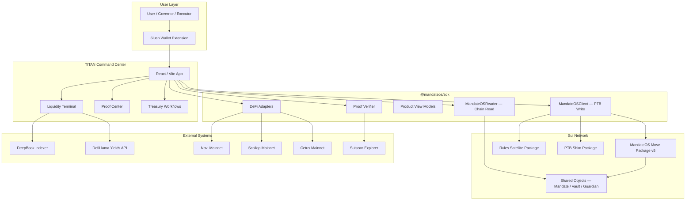
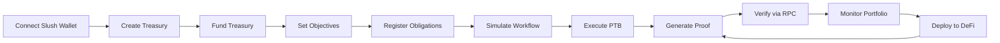
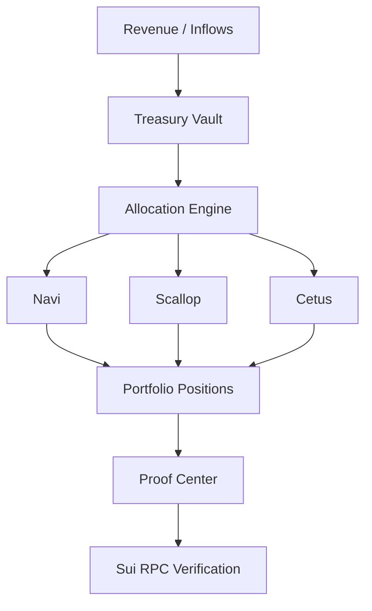
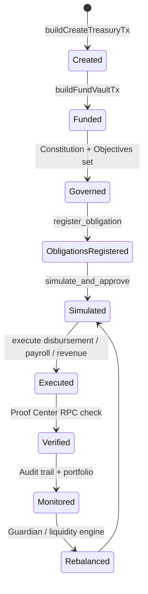
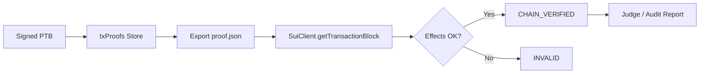
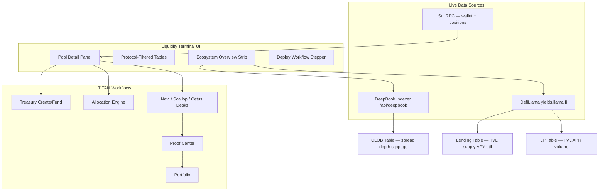

# README

<h2 align="center">TITAN</h2>

<p align="center"><strong>Programmable money infrastructure for institutional treasuries on Sui</strong></p>

<div align="center">     </div>

<p align="center"><a href="https://command-center-five-eta-sandy.vercel.app"><strong>Live Production →</strong></a> · <a href="docs/">Documentation Suite</a> · <a href="proof/deployment.json">On-Chain Proof</a></p>

***

> **TITAN** is the institutional command center. **MandateOS** is the on-chain protocol. Together they turn static balances into **programmable capital** — routed, split, allocated, protected, and verified through Move contracts and wallet-signed PTBs.

**Production:** https://command-center-five-eta-sandy.vercel.app\
**Default route:** Liquidity Terminal (`/app/markets`)

### Documentation suite

Start with the structured docs index:

* [docs](docs/)
* [Architecture](docs/architecture/)
* [Treasury System](docs/treasury-system/)
* [Programmable Money](docs/programmable-money/)
* [Move Contracts](docs/move-contracts/)
* [Workflows](docs/workflows/)
* [Integrations](docs/integrations/)
* [Audit & Proof System](docs/audit-and-proof-system/)

***

### Table of Contents

1. [Problem Statement](./#1-problem-statement)
2. [What TITAN Does](./#2-what-titan-does)
3. [Core Capabilities](./#3-core-capabilities)
4. [Architecture Overview](./#4-architecture-overview)
5. [System Flow](./#5-system-flow)
6. [Programmable Money Flow](./#6-programmable-money-flow)
7. [Treasury Lifecycle](./#7-treasury-lifecycle)
8. [Smart Wallet Rules Lifecycle](./#8-smart-wallet-rules-lifecycle)
9. [Proof Verification System](./#9-proof-verification-system)
10. [Liquidity Terminal Architecture](./#10-liquidity-terminal-architecture)
11. [Repository Structure](./#11-repository-structure)
12. [Smart Contracts](./#12-smart-contracts)
13. [PTB Usage](./#13-ptb-usage)
14. [External Integrations](./#14-external-integrations)
15. [Security Model](./#15-security-model)
16. [Verification Matrix](./#16-verification-matrix)
17. [Screenshots](./#17-screenshots)
18. [Installation](./#18-installation)
19. [Deployment](./#19-deployment)
20. [Running Verification](./#20-running-verification)
21. [Roadmap](./#21-roadmap)
22. [Why TITAN Is Different](./#22-why-titan-is-different)
23. [Reference Links](./#23-reference-links)

***

### 1. Problem Statement

| Pain                              | Consequence                                                        |
| --------------------------------- | ------------------------------------------------------------------ |
| Payments are **static**           | Money moves as one-off transfers, not as governed capital          |
| DeFi is **fragmented**            | Yield, lending, and liquidity live in disconnected dashboards      |
| Users **manually** manage capital | No constitutional rules; no simulation before execution            |
| Treasuries are **passive**        | Vaults hold funds but do not route, split, or protect autonomously |
| Verification is **difficult**     | Off-chain approvals leave no explorer-verifiable audit trail       |

**Programmable money** solves this by binding policy to on-chain objects, executing through PTBs, and recording every step as exportable, RPC-verifiable proof.

***

### 2. What TITAN Does

TITAN transforms money into **programmable capital**. Money is not simply transferred — it can:

| Capability    | Mechanism                                               |
| ------------- | ------------------------------------------------------- |
| **Route**     | Capital allocation engine + execution route plans       |
| **Split**     | Revenue mandates, subscription flows, bucket allocation |
| **Allocate**  | Multi-protocol deployment (Navi, Scallop, Cetus)        |
| **Invest**    | Investment mandates + yield hub workflows               |
| **Protect**   | Guardian policy, stress mode, risk budgets              |
| **Verify**    | Proof Center + RPC digest validation                    |
| **Rebalance** | Liquidity engine + guardian reallocation previews       |

All governed workflows follow **simulate → approve → execute** on MandateOS testnet. External DeFi deployment uses **wallet-signed mainnet PTBs** with proof linkage.

***

### 3. Core Capabilities

#### Treasury Management

| Feature             | Route / Module               | On-chain                              |
| ------------------- | ---------------------------- | ------------------------------------- |
| Treasury creation   | `/templates`, `/app/account` | `treasury_mandate::create`            |
| Funding             | Treasury Execution Panel     | `treasury_mandate::fund`              |
| Templates (8 types) | `/templates`                 | `MANDATE_TEMPLATE_CATALOG` in SDK     |
| Governance          | Mandate constitution objects | `constitutional`, `financial_mandate` |
| Preservation        | Vault + liquidity engine     | `vault`, `adaptive_liquidity`         |
| Objectives          | `/objectives`                | `objectives` module                   |
| Obligations         | `/obligations`               | `objectives` + `register_obligation`  |

#### Financial Workflows

| Workflow             | Page                                 | PTB chain                                       |
| -------------------- | ------------------------------------ | ----------------------------------------------- |
| Revenue routing      | `/app/revenue`                       | create → simulate → execute distribution        |
| Investment mandates  | `/app/yield-hub`                     | create → simulate → execute investment          |
| Payroll automation   | `/app/payroll`                       | create → simulate → execute payroll             |
| Subscriptions        | `/app/subscriptions`                 | create → simulate → execute payment             |
| Guardian actions     | `/app/guardian-actions`              | evaluate → simulate → execute corrective action |
| Risk controls        | Mandate risk profile + stress mode   | `operational_risk`, `guardian`                  |
| Capital preservation | Liquidity engine + reserve covenants | `adaptive_liquidity`, objectives                |

#### Programmable Money

* **PTB execution** — all MandateOS writes via `MandateOSClient` + dapp-kit sign
* **Multi-step execution** — workflow session: open → simulate → validate → settle → close
* **Proof-linked workflows** — every signed tx → `txProofs` in store → Proof Center
* **Wallet-driven execution** — Slush extension + `@mysten/dapp-kit`; non-custodial

#### Smart Wallet Rules

| Step          | Implementation                                                          |
| ------------- | ----------------------------------------------------------------------- |
| Rule creation | `/app/smart-wallet-rules` — balance invest, payroll date, risk withdraw |
| Rule storage  | Satellite package `mandateos-rules`                                     |
| Execution     | `buildExecuteSmartWalletRuleTx`                                         |
| Verification  | `proof/smart-wallet-rules-verification.json` — **CHAIN\_VERIFIED**      |
| Audit trail   | Rule events + Proof Center                                              |

Rule types: `balance_invest`, `payroll_date`, `risk_withdraw`.

#### Capital Deployment

| Desk              | Route                                | Network                             |
| ----------------- | ------------------------------------ | ----------------------------------- |
| Allocation Engine | `/app/allocation`                    | Mainnet (3-signature sequential)    |
| Navi Capital      | `/app/navi-capital`                  | Mainnet lending                     |
| Scallop Capital   | `/app/scallop-capital`               | Mainnet lending                     |
| Cetus Capital     | `/app/cetus-capital`                 | Mainnet CLMM LP                     |
| Protocol adapters | `@mandateos/sdk` `PROTOCOL_ADAPTERS` | Position reads + PTB builders       |
| Portfolio         | `/app/portfolio`                     | Wallet + vault + protocol positions |

> **Cross-network note:** MandateOS treasury runs on **testnet** today. DeFi desks deploy **mainnet** wallet capital (external capital deployment mode). Unified programmable money requires MandateOS on mainnet.

#### Liquidity Terminal

| Capability                  | Source                                                               |
| --------------------------- | -------------------------------------------------------------------- |
| Live opportunity discovery  | DefiLlama yields + DeepBook indexer                                  |
| Protocol-specific views     | Lending / LP / CLOB tables (no forced UNAVAILABLE columns)           |
| Ecosystem overview          | Aggregated TVL, volume, APR, DeepBook fees                           |
| Capital deployment workflow | Discover → Select → Treasury → Allocate → Deploy → Portfolio → Proof |
| Portfolio intelligence      | Wallet SUI, treasury liquid, protocol positions in detail panel      |

Route: `/app/markets`

#### Portfolio System

* Live wallet balance (Sui RPC)
* Mandate vault fields (on-chain read)
* Protocol positions (Navi, Scallop, Cetus adapters)
* Allocation visibility via capital engine buckets
* Proof-linked positions after deploy workflows

#### Proof Center

| Capability            | Location                                                 |
| --------------------- | -------------------------------------------------------- |
| Proof generation      | Auto on every signed PTB                                 |
| Proof export          | `proofExport.ts` → downloadable JSON                     |
| RPC verification      | `verifyProofDocument()` in SDK                           |
| Explorer verification | Suiscan links per digest                                 |
| Digest verification   | `verifyProofStep()` per tx                               |
| Evidence model        | digest, wallet, objectIds, events, protocol, rpcVerified |

Route: `/proof`

#### Hidden / analytics routes (dev or simulation)

Not in production sidebar; derived view models or dead UI:

| Route                                                                                                       | Status                          |
| ----------------------------------------------------------------------------------------------------------- | ------------------------------- |
| `/overview`, `/capital`, `/protection`, `/guardian`, `/risk`, `/position`, `/trace`, `/yield`, `/ecosystem` | Simulation / analytics          |
| `/app/trade`, `/app/advisor`, `/app/strategies`, `/app/liquidity`, `/app/yield-tokens`                      | Hidden or dead UI in production |

***

### 4. Architecture Overview



***

### 5. System Flow



| Step            | What happens                                           |
| --------------- | ------------------------------------------------------ |
| Connect         | Slush `standard:connect` on production HTTPS origin    |
| Create Treasury | Template or custom → `buildCreateTreasuryTx`           |
| Fund            | Split coins → `treasury_mandate::fund`                 |
| Objectives      | On-chain charter fields — read at `/objectives`        |
| Obligations     | `buildRegisterObligationTx`                            |
| Simulate        | PTB shim `simulate_and_approve` → `SimulationApproval` |
| Execute         | Executor settles with approval witness                 |
| Proof           | Digest + object IDs stored → Proof Center              |
| Verify          | `verifyProofDocument` against Sui RPC                  |
| Portfolio       | Positions from adapters + vault read                   |

***

### 6. Programmable Money Flow



| Stage          | Description                                                                           |
| -------------- | ------------------------------------------------------------------------------------- |
| **Revenue**    | Revenue split mandate distributes inflows per charter                                 |
| **Treasury**   | `MandateVault` holds liquid + illiquid balances                                       |
| **Allocation** | Capital engine computes bucket targets; Allocation page executes sequential DeFi PTBs |
| **Protocol**   | Wallet-signed deposit to Navi / Scallop / Cetus on mainnet                            |
| **Portfolio**  | Live position reads via protocol adapters                                             |
| **Proof**      | Each digest exportable; RPC verifies effects on chain                                 |

***

### 7. Treasury Lifecycle



***

### 8. Smart Wallet Rules Lifecycle


Package: `0x9c97a6e3ba609f114b8069334cf88f467217893f2a9c44301a8227f66b57b5ed` (testnet)\
Verification: `proof/smart-wallet-rules-verification.json` — **CHAIN\_VERIFIED**

***

### 9. Proof Verification System

#### Evidence model

Each proof record contains:

| Field          | Purpose                                |
| -------------- | -------------------------------------- |
| `digest`       | Transaction hash                       |
| `wallet`       | Signer address                         |
| `objectIds`    | Created/mutated objects                |
| `events`       | Emitted Move events                    |
| `protocol`     | MandateOS / navi / scallop / cetus     |
| `workflowType` | treasury / payroll / allocation / etc. |
| `rpcVerified`  | Result of `verifyProofStep`            |
| `explorerUrl`  | Suiscan deep link                      |

#### Verification pipeline



#### SDK functions

```typescript
verifyProofStep(step)      // Single digest validation
verifyProofDocument(doc)   // Full document validation
```

#### UI

* **Proof Center** (`/proof`) — list, filter, export
* **ProofVerificationPanel** — import and verify external JSON
* Auto-verify hooks in `useDefiProtocolWorkflow`, `useUnifiedAllocationPtb`

***

### 10. Liquidity Terminal Architecture



**Protocol-specific columns** — fees/APR/TVL columns removed when not applicable (see `docs/LIQUIDITY_TERMINAL_FIELD_AUDIT.md`).

***

### 11. Repository Structure

```
.
├── mandateos/                    # Core Move protocol (26 on-chain modules in v5, 9 test modules)
├── mandateos-rules/              # Satellite smart_wallet_rules package
├── mandateos-ptb-shim/           # PTB-safe simulate_and_approve shim
├── packages/
│   ├── mandateos-sdk/            # @mandateos/sdk — PTB builders, readers, DeFi, proof
│   └── command-center/           # TITAN React app (Vite)
│       ├── src/
│       │   ├── components/       # UI by domain (liquidity-terminal/, proof, treasury, …)
│       │   ├── hooks/            # 35 data/workflow hooks
│       │   ├── lib/              # Integrations (deepbook, defillama, wallet, proof)
│       │   ├── pages/            # Routed pages
│       │   ├── providers/        # dapp-kit + Titan wallet context
│       │   └── store/            # Zustand mandate + txProofs
│       └── public/               # titan-logo.png, static assets
├── proof/                        # Deployment + verification JSON artifacts
├── scripts/                      # Judge verification, deploy, proof validation
├── docs/                         # Technical docs + reports/
│   ├── FEATURE_INVENTORY.md      # Full feature inventory (source of truth)
│   ├── LIQUIDITY_TERMINAL_*.md   # Terminal data audits
│   └── reports/                  # Judge, DeFi, reality audits
├── vercel.json                   # Production build + DeepBook/CoinGecko proxies
├── DEPLOYMENT.md                 # Testnet publish commands
└── DEPLOYMENT_CHECKLIST.md       # Pre-flight checklist
```

***

### 12. Smart Contracts

#### MandateOS Core (testnet v5)

| Field              | Value                                                                                                                    |
| ------------------ | ------------------------------------------------------------------------------------------------------------------------ |
| **Package ID**     | `0xab08c97952d7ca39b1cf1f3d773d940f5d56ed8235da65b1c313ddcdec555e13`                                                     |
| **Upgrade digest** | `6vzEqvHNQWLA6BSTfreiT1YdET5XwSf7XnGkwdN6kGsb`                                                                           |
| **UpgradeCap**     | `0x8133621db94776a6f146163d249695f5e6b30fdf7bcd972afd21fce3846d284f`                                                     |
| **AdminCap**       | `0x1eaf17fe6dc3b283eda837f86d9ea8a5ea124fea77228c8db3773ff59d8ba3af`                                                     |
| **Governor**       | `0xd0de6a0cff4368a5cb26d1f13595d3c5e0e46972303020d78c11c6ef77e5e10b`                                                     |
| **Explorer**       | [Suiscan Package](https://suiscan.xyz/testnet/object/0xab08c97952d7ca39b1cf1f3d773d940f5d56ed8235da65b1c313ddcdec555e13) |

#### Module reference (26 core modules, package v5)

| Module                       | Purpose                            | Key objects / role                |
| ---------------------------- | ---------------------------------- | --------------------------------- |
| `mandateos`                  | Package init, version, admin entry | `AdminCap`, package metadata      |
| `types`                      | Shared structs and enums           | Core type definitions             |
| `financial_mandate`          | Core mandate charter               | `FinancialMandate`                |
| `vault`                      | Coin custody                       | `MandateVault<T>`                 |
| `constitutional`             | Enforceable limits                 | `FinancialConstitution`           |
| `objectives`                 | Goals + obligations registry       | `ObligationRegistry`              |
| `rules`                      | Mandate rule graph                 | Rule objects linked to charter    |
| `workflow`                   | PTB pipeline witnesses             | `ExecutionAuthorization`, session |
| `simulation`                 | Dry-run approvals                  | `SimulationApproval`              |
| `validation`                 | Pre-settlement checks              | Validation witnesses              |
| `authority`                  | Role and permission wiring         | Authority caps                    |
| `operational_risk`           | Risk profile + stress mode         | Risk budget objects               |
| `adaptive_liquidity`         | Liquidity engine / preservation    | Reserve covenants                 |
| `deepbook_forecast`          | DeepBook-linked forecast hooks     | Forecast structs (on-chain)       |
| `guardian`                   | Autonomous monitoring              | `GuardianPolicy`                  |
| `delegation`                 | Agent caps                         | `ExecutorCap`                     |
| `intent`                     | Workflow intent objects            | Intent registry                   |
| `intent_compiler`            | Intent → executable plan           | Compiler witnesses                |
| `receipts`                   | Audit receipts                     | Per-layer receipt objects         |
| `templates`                  | On-chain template registry         | Template catalog objects          |
| `treasury_mandate`           | Org treasury type                  | Treasury mandate objects          |
| `dao_treasury_mandate`       | DAO treasury variant               | DAO treasury objects              |
| `payroll_mandate`            | Payroll flows                      | Payroll mandate objects           |
| `revenue_allocation_mandate` | Revenue splits                     | Revenue mandate objects           |
| `auto_investment_mandate`    | Investment flows                   | Investment mandate objects        |
| `subscription_mandate`       | Recurring payments                 | Subscription mandate objects      |

> **Note:** `smart_wallet_rules` ships in the separate `mandateos-rules` satellite package (not in core v5 bytecode).

#### PTB Shim (testnet v2)

| Field      | Value                                                                |
| ---------- | -------------------------------------------------------------------- |
| Package ID | `0x70cba71ba84b852a83c66f3cddad429c98d082cffdc7638fa21e98faecf26af9` |
| Module     | `client` — wraps `simulate_and_approve` for PTB safety               |

#### Smart Wallet Rules (testnet v1)

| Field      | Value                                                                |
| ---------- | -------------------------------------------------------------------- |
| Package ID | `0x9c97a6e3ba609f114b8069334cf88f467217893f2a9c44301a8227f66b57b5ed` |
| Module     | `smart_wallet_rules`                                                 |
| Status     | CHAIN\_VERIFIED                                                      |

#### Ownership model

* **Governor** holds `AdminCap` / governance rights
* **ExecutorCap** delegates scoped execution with daily/per-tx limits
* **Shared objects** — mandate graph visible on-chain
* **Witness pattern** — vault debits require workflow authorization

***

### 13. PTB Usage

PTBs are the execution primitive for all writes.

```mermaid
flowchart TD
  subgraph MandateOS PTBs["MandateOS PTBs (Testnet)"]
    T1[Create Treasury]
    T2[Fund Vault]
    T3[Register Obligation]
    T4[Simulate Workflow]
    T5[Execute Disbursement]
    T6[Guardian Action]
    T7[Delegate Agent]
    T8[Smart Wallet Rule Execute]
  end

  subgraph DeFi PTBs["DeFi PTBs (Mainnet Wallet)"]
    D1[Navi Deposit/Withdraw]
    D2[Scallop Deposit/Withdraw]
    D3[Cetus Add/Remove LP]
    D4[Sequential Allocation 3x Sign]
  end

  SW[Slush Wallet Sign] --> MandateOS PTBs
  SW --> DeFi PTBs
  MandateOS PTBs --> PROOF[Proof Center]
  DeFi PTBs --> PROOF
```

| Domain     | SDK entry points                                                                                            |
| ---------- | ----------------------------------------------------------------------------------------------------------- |
| Treasury   | `buildCreateTreasuryTx`, `buildFundVaultTx`, `buildExecuteTreasuryDisbursementTx`                           |
| Payroll    | `buildCreatePayrollTx`, `buildSimulatePayrollTx`, `buildExecutePayrollTx`                                   |
| Revenue    | `buildCreateRevenueAllocationTx`, `buildSimulateRevenueDistributionTx`, `buildExecuteRevenueDistributionTx` |
| Investment | `buildCreateAutoInvestmentTx`, `buildExecuteInvestmentTx`                                                   |
| Guardian   | `buildEvaluateGuardianTx`, `buildExecuteGuardianActionTx`                                                   |
| Rules      | `buildExecuteSmartWalletRuleTx`                                                                             |
| Allocation | `useUnifiedAllocationPtb` (sequential); `buildMultiProtocolAllocationPtb` (reserved, throws)                |
| DeFi       | `buildNaviDepositTransaction`, `buildScallopDepositTransaction`, `buildCetusDepositTransaction`             |

Every PTB: **wallet signs → digest captured → proof exportable → RPC verifiable**.

***

### 14. External Integrations

| Integration      | Purpose            | Data used                                 | Workflow usage                        | Status                                   |
| ---------------- | ------------------ | ----------------------------------------- | ------------------------------------- | ---------------------------------------- |
| **DeepBook**     | CLOB market data   | Order book, trades, ticker, volume, fees  | Liquidity Terminal CLOB table         | **Live reads** via `/api/deepbook` proxy |
| **DefiLlama**    | Yield/TVL metrics  | `tvlUsd`, `apy`, `volumeUsd1d`, pool rows | Terminal overview + lending/LP tables | **Live reads**                           |
| **Navi**         | Lending deploy     | Positions, deposit/withdraw PTBs          | Navi Capital desk, Allocation         | **Code complete**; mainnet wallet-signed |
| **Scallop**      | Lending deploy     | Scallop SDK positions + PTBs              | Scallop Capital desk                  | **Code complete**                        |
| **Cetus**        | CLMM LP            | Cetus SDK LP PTBs                         | Cetus Capital desk                    | **Code complete**                        |
| **Slush Wallet** | Non-custodial sign | `standard:connect`, accounts              | All write workflows                   | **Production**                           |
| **Sui RPC**      | Chain read/write   | Objects, balances, tx effects             | Reader + proof verify                 | **Live**                                 |
| **Suiscan**      | Explorer links     | Tx/object URLs                            | Proof Center, ObjectLink              | **Live**                                 |

> DeFi adapters mark `verified: false` until wallet-signed mainnet proofs exist in Proof Center. See `proof/defi-verification.json`.

***

### 15. Security Model

| Layer                  | Mechanism                                                     |
| ---------------------- | ------------------------------------------------------------- |
| **Ownership**          | Governor / AdminCap; no protocol custody of user keys         |
| **Capabilities**       | `ExecutorCap` with `max_per_tx`, `max_daily`, expiry          |
| **Object model**       | Mandate owns vault; debits require workflow witness           |
| **Rule enforcement**   | Constitution + validation module before settlement            |
| **Guardian**           | Stress mode blocks Liquidity Terminal deploy                  |
| **Proof verification** | RPC re-fetch validates digest independently                   |
| **Non-custodial**      | Slush holds keys; TITAN never sees private material           |
| **Execution gate**     | `VITE_UPGRADE_VERIFIED=true` required for production PTBs     |
| **Origin gate**        | Slush connect blocked on localhost; production HTTPS required |

***

### 16. Verification Matrix

Truthful statuses from code + `proof/` artifacts.

| Feature                                | Status              | Evidence                                     | Verification method               |
| -------------------------------------- | ------------------- | -------------------------------------------- | --------------------------------- |
| MandateOS package publish              | **CHAIN\_VERIFIED** | `proof/deployment.json`                      | Suiscan package object            |
| Package upgrade v5                     | **CHAIN\_VERIFIED** | Upgrade digest `6vzEqv…`                     | Suiscan tx                        |
| SDK entrypoints vs on-chain            | **VERIFIED**        | `proof/entrypoint-verification.json`         | `verify-on-chain-entrypoints.mjs` |
| Treasury create/fund/simulate/execute  | **CHAIN\_VERIFIED** | `proof/judge-verification.json`              | Judge verification script         |
| Smart wallet rules                     | **CHAIN\_VERIFIED** | `proof/smart-wallet-rules-verification.json` | Rules sprint script               |
| Proof Center RPC verify                | **IMPLEMENTED**     | `verify-proof.ts`                            | `npm run verify:proof`            |
| Liquidity Terminal data                | **LIVE API**        | DefiLlama + DeepBook fetch                   | Field audit doc                   |
| Navi deposit/withdraw                  | **CODE\_EXISTS**    | SDK + UI wired                               | Wallet sign + Proof Center        |
| Scallop deposit/withdraw               | **CODE\_EXISTS**    | SDK + UI wired                               | Wallet sign + Proof Center        |
| Cetus LP deposit/withdraw              | **CODE\_EXISTS**    | SDK + UI wired                               | Wallet sign + Proof Center        |
| Multi-protocol allocation              | **CODE\_EXISTS**    | 3-signature sequential flow                  | Proof bundle export               |
| Unified single-PTB allocation          | **PLANNED**         | `buildMultiProtocolAllocationPtb` throws     | Not implemented                   |
| Bridge / Wormhole                      | **BLOCKED**         | `proof/bridge-implementation-status.json`    | Not verified                      |
| MandateOS mainnet                      | **NOT DEPLOYED**    | No mainnet package ID                        | Future                            |
| CoinGecko trade terminal               | **DEAD\_UI**        | No swap PTB                                  | Hidden in production              |
| Analytics routes (/capital, /guardian) | **SIMULATION**      | Derived view models                          | Hidden in production              |

***

### 17. Screenshots

> Place captured screenshots in `proof/screenshots/` and update paths below.

| Screen             | Path                                       | Description                                         |
| ------------------ | ------------------------------------------ | --------------------------------------------------- |
| Liquidity Terminal | `proof/screenshots/liquidity-terminal.png` | Ecosystem overview + protocol tables + detail panel |
| Treasury Account   | `proof/screenshots/treasury-account.png`   | Unified account, registry, Sankey                   |
| Portfolio          | `proof/screenshots/portfolio.png`          | Wallet + vault + DeFi positions                     |
| Allocation Engine  | `proof/screenshots/allocation.png`         | Multi-protocol capital allocation                   |
| Proof Center       | `proof/screenshots/proof-center.png`       | Proofs + RPC verification badges                    |
| Smart Wallet Rules | `proof/screenshots/smart-wallet-rules.png` | Rule creation + execution                           |
| Navi Capital Desk  | `proof/screenshots/navi-capital.png`       | Protocol status cards + deposit flow                |
| Guardian Actions   | `proof/screenshots/guardian-actions.png`   | Evaluate / simulate / execute                       |

***

### 18. Installation

#### Prerequisites

| Tool            | Version                       |
| --------------- | ----------------------------- |
| Node.js         | 20+                           |
| npm             | 10+ (workspaces)              |
| Sui CLI         | 1.63+                         |
| Slush extension | Latest (for wallet workflows) |

#### Clone and install

```bash
git clone <repository-url>
cd <repo-root>
npm install
```

#### Build SDK

```bash
npm run build:sdk
```

#### Command Center environment

Copy and configure:

```bash
cp packages/command-center/.env.production packages/command-center/.env.local
```

| Variable                             | Required | Description                       |
| ------------------------------------ | -------- | --------------------------------- |
| `VITE_MANDATEOS_PACKAGE_ID`          | Yes      | MandateOS testnet package         |
| `VITE_MANDATEOS_PTB_SHIM_PACKAGE_ID` | Yes      | PTB shim package                  |
| `VITE_SUI_NETWORK`                   | Yes      | `testnet` (current deployment)    |
| `VITE_UPGRADE_VERIFIED`              | Yes      | Must be `true` for PTB execution  |
| `VITE_SLUSH_WALLET_URL`              | Yes      | Production HTTPS origin for Slush |
| `VITE_DEMO_MODE`                     | No       | Default `false` for production    |
| `VITE_COINGECKO_ENABLED`             | No       | Default enabled unless `false`    |

#### Run locally

```bash
npm run dev:cc
# Command Center → http://localhost:5173
# Note: Slush wallet requires deployed HTTPS origin (not localhost)
```

#### Move contracts (optional local build)

```bash
cd mandateos
sui move build
sui move test
```

***

### 19. Deployment

#### Testnet contracts

```bash
cd mandateos
# Readiness check
../mandateos/scripts/verify-readiness.ps1
# Publish or upgrade
../mandateos/scripts/upgrade-testnet.ps1
```

Canonical IDs: `proof/deployment.json`

#### Vercel (Command Center)

```bash
# From repo root (linked project)
npx vercel --prod --scope <your-team>
```

Or:

```bash
npm run deploy:vercel
```

Build command (from `vercel.json`):

```
npm run build:sdk && npm run build -w @mandateos/command-center
```

Output: `packages/command-center/dist`

Sync env vars:

```bash
powershell -ExecutionPolicy Bypass -File scripts/push-vercel-env.ps1
```

#### Mainnet (future)

1. Publish MandateOS to Sui mainnet
2. Set `VITE_SUI_NETWORK=mainnet`
3. Update package IDs in Vercel env
4. Enables unified treasury + DeFi on same network

See `docs/reports/MAINNET_READINESS_REPORT.md`.

***

### 20. Running Verification

#### Proof document verification

```bash
node scripts/verify-proof.mjs path/to/proof.json
```

#### On-chain entrypoint check

```bash
node scripts/verify-on-chain-entrypoints.mjs
```

#### Full judge verification (testnet)

```bash
npx tsx scripts/run-judge-verification.ts
# Output: proof/judge-verification.json
```

#### Smart wallet rules sprint

```bash
npx tsx scripts/smart-wallet-rules-sprint.ts
```

#### DeFi wallet verification (requires mainnet SUI + Slush)

```bash
npx tsx scripts/run-defi-chain-verified.ts
```

#### UI proof verification

1. Open `/proof`
2. Export proof JSON
3. Use **Verify Proof** panel or CLI script above
4. Confirm `CHAIN_VERIFIED` status + Suiscan links

***

### 21. Roadmap

#### Current state (shipped)

* MandateOS v5 on Sui testnet with full workflow modules
* TITAN Command Center with 21 production navigation routes
* Institutional Liquidity Terminal (protocol-specific views, live DefiLlama + DeepBook)
* Wallet-signed DeFi desks (Navi, Scallop, Cetus)
* Proof Center with RPC verification
* Smart wallet rules satellite — CHAIN\_VERIFIED
* Slush wallet integration on production HTTPS

#### Near-term

* [ ] MandateOS mainnet publish (unified programmable money)
* [ ] DeFi CHAIN\_VERIFIED proofs in Proof Center for reference wallet
* [ ] Single-PTB multi-protocol allocation (`buildMultiProtocolAllocationPtb`)
* [ ] Screenshot capture for judge package
* [ ] TypeScript remediation (see `TYPESCRIPT_REMEDIATION_REPORT.md`)

#### Future

* [ ] Cross-chain bridge (Wormhole) — currently blocked
* [ ] DeepBook execution PTBs (beyond market data reads)
* [ ] AI-assisted treasury rebalancing with guardian gates
* [ ] Template marketplace on-chain governance
* [ ] Multi-entity mandate federation

***

### 22. Why TITAN Is Different

Generic DeFi dashboards show **yields and TVL**. TITAN connects **treasury policy → PTB execution → proof verification → capital deployment** in one continuous system.

| Generic DeFi app           | TITAN                                                           |
| -------------------------- | --------------------------------------------------------------- |
| Connect wallet, swap/stake | Connect wallet, **create constitutional treasury**              |
| View APY tables            | **Simulate then execute** with `SimulationApproval`             |
| Manual transfers           | **Agent delegation** with on-chain caps                         |
| No audit trail             | **Proof Center** — export + RPC verify every digest             |
| Siloed protocol UIs        | **Liquidity Terminal → Allocation → Protocol desk → Portfolio** |
| Off-chain rules            | **Smart wallet rules** as Move objects                          |
| Reactive risk              | **Guardian** autonomous monitoring + corrective PTBs            |

TITAN is not a yield aggregator. It is **programmable money infrastructure**: the operating system layer where treasuries, rules, proofs, and DeFi deployment meet on Sui.

***

### 23. Reference Links

| Resource                    | URL                                                                                                        |
| --------------------------- | ---------------------------------------------------------------------------------------------------------- |
| Production app              | https://command-center-five-eta-sandy.vercel.app                                                           |
| MandateOS package (testnet) | https://suiscan.xyz/testnet/object/0xab08c97952d7ca39b1cf1f3d773d940f5d56ed8235da65b1c313ddcdec555e13      |
| Upgrade tx                  | https://suiscan.xyz/testnet/tx/6vzEqvHNQWLA6BSTfreiT1YdET5XwSf7XnGkwdN6kGsb                                |
| Feature inventory           | [TITAN / MandateOS — Repository Feature Inventory](docs/references/feature_inventory.md)                   |
| Liquidity field audit       | [Liquidity Terminal — Field Availability Audit](docs/liquidity-terminal/liquidity_terminal_field_audit.md) |
| Deployment record           | [proof/deployment.json](proof/deployment.json)                                                             |
| Judge verification          | [proof/judge-verification.json](proof/judge-verification.json)                                             |
| Deploy checklist            | [MandateOS — Deployment Checklist (Phase 7.1)](docs/deployment/deployment_checklist.md)                    |
| Vercel deploy guide         | [Deploy from repo ROOT (required for npm workspaces + @mandateos/sdk)](docs/deployment/deploy_vercel.md)   |
| All audit reports           | [TITAN Reports Archive](docs/references/reports/)                                                          |

***

<p align="center"><sub>TITAN · MandateOS · Built on Sui · Non-custodial · Proof-verified</sub></p>
