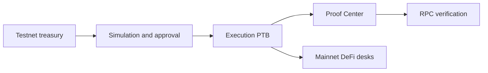

# Architecture

## System architecture

TITAN is split into four layers:

* Command Center UI
* `@mandateos/sdk`
* MandateOS Move packages
* External protocol and data integrations

```mermaid
flowchart TB
  U[User] --> CC[Command Center]
  CC --> SDK[@mandateos/sdk]
  SDK --> MO[MandateOS Move]
  SDK --> EXT[DeFi and data providers]
  MO --> OBJ[Shared treasury objects]
  EXT --> PF[Portfolio and proof views]
```

### Runtime model

Treasury workflows execute against MandateOS on testnet.

Protocol capital desks and position reads target mainnet protocols today.



### Main components

* **UI** — Treasury, workflows, proof, portfolio, capital desks.
* **SDK write layer** — PTB builders and execution helpers.
* **SDK read layer** — Mandate decode, audit history, portfolio aggregation.
* **Protocol layer** — Mandates, vaults, approvals, delegation, guardian, rules.

### Core references

* [Deployed System Diagrams](../audit-and-proof-system/proof/diagrams.md)
* [Product Architecture](architecture.md)
* [Bridge Architecture](../bridge-routing/bridge_architecture.md)
* [Move Contracts](../move-contracts/)
* [UI Surface Inventory](ui-surface-inventory.md)
