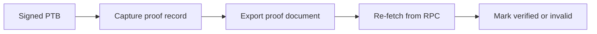

# Audit & Proof System

## Audit and proof system

TITAN records workflow evidence as proof artifacts.

Each wallet-signed PTB can produce a digest-linked record that is exportable and independently verifiable against Sui RPC.

### Proof model

A proof record can include:

* digest
* signer wallet
* object IDs
* events
* protocol and workflow type
* verification result
* explorer link

### Verification pipeline

### Artifact scope

The current evidence set covers deployment, entrypoint checks, judge workflows, smart wallet rules, and DeFi verification status.

### Source evidence

* [Judge Verification Pack](proof/)
* [Judge Readiness Report](judge_readiness_report.md)
* [Reports Archive](../references/reports/)
