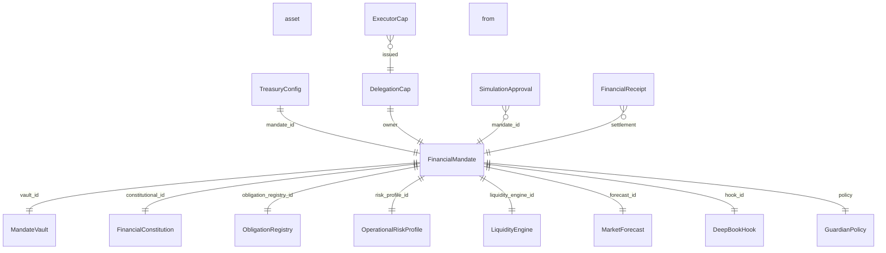
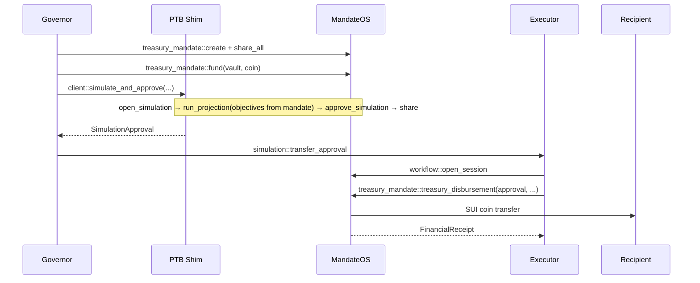
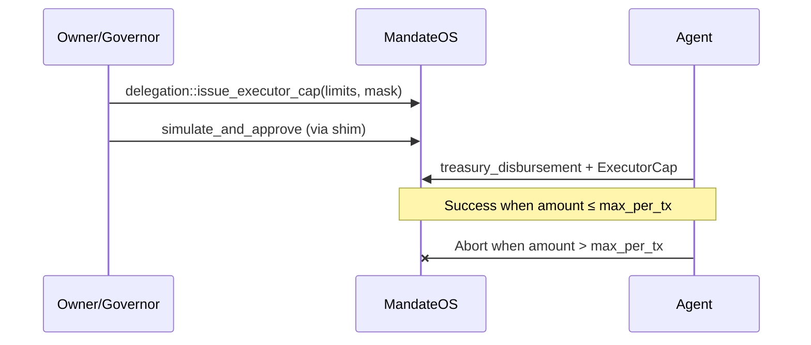
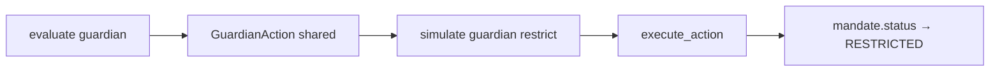

# MandateOS — Deployed System Diagrams

## 1. Architecture (testnet)

```mermaid
flowchart TB
  subgraph Clients
    CC[Command Center React UI]
    SDK[@mandateos/sdk PTB Builder]
    CLI[testnet-proof.ts]
  end

  subgraph OnChainTestnet
    PKG["MandateOS Package\n0x96e7…3713\n26 modules"]
    SHIM["PTB Shim Package\n0x6214…a00b\nclient::simulate_and_approve"]
    GOV[Governor keystore\nkind-chrysolite]
    EXE[Executor keypair\nrole holder]
    AGT[Agent keypair\nExecutorCap]
  end

  subgraph SharedObjects
    M[FinancialMandate]
    V[MandateVault]
    C[FinancialConstitution]
    GP[GuardianPolicy]
    LE[LiquidityEngine]
  end

  CC -->|MandateOSReader RPC| M
  SDK --> PKG
  SDK --> SHIM
  CLI --> SDK
  GOV -->|simulate / create / fund| PKG
  GOV -->|simulate_and_approve| SHIM
  SHIM --> PKG
  EXE -->|treasury_disbursement| PKG
  AGT -->|delegated execute| PKG
  M --- V
  M --- C
  M --- GP
  M --- LE
```

## 2. Object graph (live treasury proof)



**Live IDs** (from `proof/testnet-results.json`):

| Node | Object ID |
|------|-----------|
| FinancialMandate | `0x0537293ee980082cc55c2a623ce243a78b34f897b7b422e6aa83545ad556e5ed` |
| MandateVault | `0x862c4b7cfd5988e55d5f72b7dfc8ab797895831f3ec97a48268ff004a0b8594f` |
| FinancialConstitution | `0x6006d3dc8ffcecb2fa8017fdb2ede117a6f8cdcd44c8f1efa5c40a5445e53841` |
| SimulationApproval | `0xf20bc84dbff1a5b39c4b2b076c0da98572541571bca2c2db78739c44f173e318` |

## 3. PTB execution — treasury disbursement



## 4. PTB execution — agent delegation



## 5. Guardian AUTO_RESTRICT



Explorer: see `GUARDIAN_DEMO.md` after full proof run.
