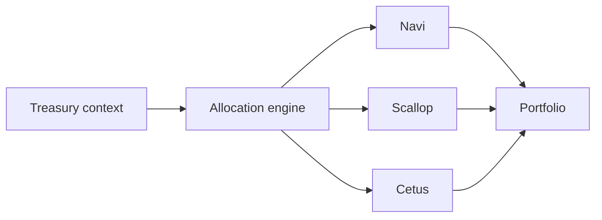

# Capital Deployment

## Capital deployment

Capital deployment is the layer that routes treasury capital into external protocols.

Today it is wallet-signed, proof-linked, and protocol-specific.

### Covered desks

* Navi Capital
* Scallop Capital
* Cetus Capital
* Allocation Engine

### Routing model

### Current status

The desk flows are implemented.

Mainnet position reads exist. Wallet-native deposits and withdrawals are wired. Chain-verified reference proofs are still pending for the full DeFi stack.

### Section pages

* [Allocation Engine](allocation-engine.md)
* [Protocol capital desks](protocol-capital-desks.md)
* [Allocation](../workflows/allocation.md)
* [Integrations](../integrations/)

### Source evidence

* [Judge Readiness Report](../audit-and-proof-system/judge_readiness_report.md)
* [DeFi Final Verification](../references/reports/defi_final_verification.md)
* [Mainnet Readiness Report](../deployment/mainnet_readiness_report.md)
