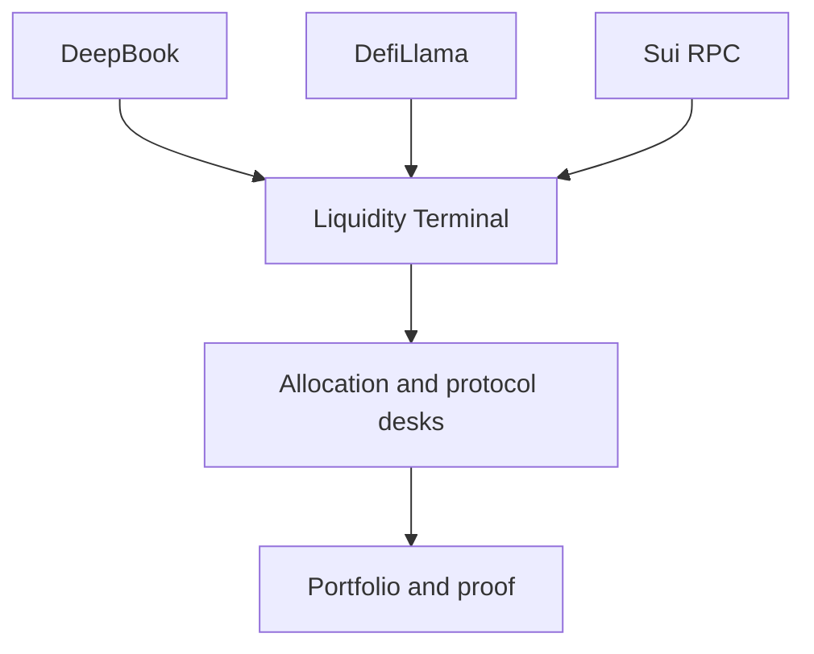

# Liquidity Terminal

## Liquidity terminal

The Liquidity Terminal is TITAN’s market discovery surface.

It aggregates live market and protocol data, then hands selected opportunities into treasury and capital deployment workflows.

### Data sources

* DeepBook indexer for Sui order-book data
* DefiLlama for yield and TVL data
* Sui RPC for wallet and portfolio state

### Pipeline

### Current status

Provider reads are live.

Protocol-specific views and field availability are documented. Some earlier simulation-heavy market views were hidden from the production path.

### Source evidence

* [Liquidity Terminal — Data Pipeline Mapping Report](liquidity_terminal_mapping.md)
* [Liquidity Terminal — Data Pipeline Audit](liquidity_terminal_pipeline_audit.md)
* [Liquidity Terminal — Field Availability Audit](liquidity_terminal_field_audit.md)
