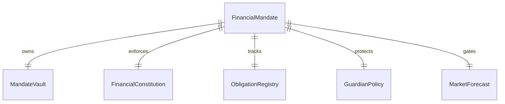

# Move Contracts

## Move contracts

MandateOS core ships as a 26-module Move package on Sui testnet.

A separate satellite package holds the smart wallet rules module.

### Package coverage

* Core protocol package
* PTB shim package
* Smart wallet rules satellite package

### Module families

* Shared primitives and types
* Treasury and mandate modules
* Workflow, simulation, and validation modules
* Risk, guardian, and liquidity modules
* Template and workflow-specific mandate modules

### Object model

### Source evidence

* [Repository Feature Inventory](../references/feature_inventory.md)
* [Deployed System Diagrams](../audit-and-proof-system/proof/diagrams.md)

### Module reference

* [financial\_mandate.move](financial_mandate.move.md)
* [vault.move](vault.move.md)
* [objectives.move](objectives.move.md)
* [guardian.move](guardian.move.md)
* [delegation.move](delegation.move.md)
* [workflow.move](workflow.move.md)
* [smart\_wallet\_rules.move](smart_wallet_rules.move.md)
* [adaptive\_liquidity.move](adaptive_liquidity.move.md)
* [deepbook\_forecast.move](deepbook_forecast.move.md)
* [simulation.move](simulation.move.md)
* [validation.move](validation.move.md)
* [Remaining core modules](remaining-core-modules.md)
