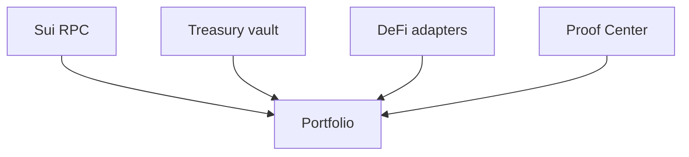

# Portfolio

## Portfolio management

Portfolio ties together treasury state, external protocol positions, and proof-linked activity.

It is the reporting surface for deployed capital.

### Coverage

* Wallet balances
* Treasury vault balances
* Obligation fulfillment context
* External protocol positions
* Bridge entries from recorded proofs

### Monitoring model

### Current status

On-chain treasury and wallet views are live.

External protocol positions are integrated but still depend on mainnet verification evidence for end-to-end proof claims.

### Source evidence

* [Portfolio · Yield Hub · CoinGecko Trace](portfolio_yield_coingecko_trace.md)
* [Production Reality Audit](../references/reports/production_reality_audit.md)
