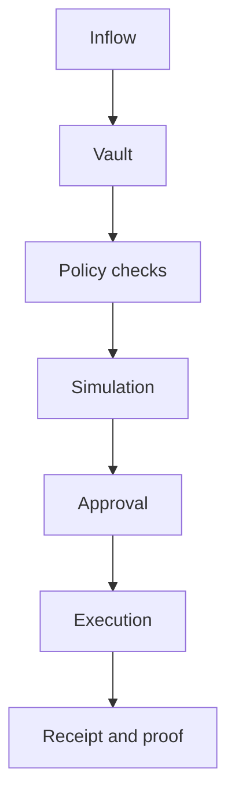

# Programmable Money

## Programmable money

Programmable money is TITAN’s policy and execution layer.

It combines treasury state, obligations, reserve rules, simulation, authorization, and receipts into one operating model.

### Core concepts

* **Objectives** define treasury goals.
* **Obligations** define required payouts or transfers.
* **Policies** define allowed execution boundaries.
* **Reserve covenants** protect liquidity.
* **Guardian controls** enforce emergency actions.
* **Forecasts** gate execution freshness.
* **Mandates** bind all of the above to a treasury object graph.

### Flow

### What changes versus static payments

A static payment moves funds once.

A programmable payment enforces intent, validates state, records proof, and preserves downstream treasury context.

### Current status

Treasury, payroll, revenue, investment, guardian, and smart-wallet flows are documented as implemented.

Chain-verified execution exists for core MandateOS workflows on testnet. Cross-protocol and cross-network chains remain split by network today.

### Source evidence

* [Programmable Money Audit](programmable_money_audit.md)
* [Judge Flow](../workflows/judge_flow.md)
* [Smart Wallet Rules Verification](../smart-wallet-rules/smart_wallet_rules_verification.md)
