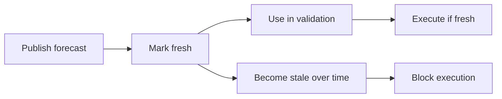

# Forecast System

## Forecast system

The forecast system controls whether market-linked execution can proceed.

It exists to prevent stale assumptions from driving treasury actions.

### Core objects

* `OracleCap`
* `MarketForecast`

### Freshness model

Forecasts have a freshness boundary.

If that boundary is exceeded, execution should fail closed.

### Abort behavior

The documented stale-forecast path includes `EForecastStale` and abort code `23`.

### Lifecycle

### Status

The forecast layer is part of the package design and object graph.

Execution-gating behavior is documented at the architecture level. A dedicated proof set for forecast-specific abort and refresh scenarios should be added later.

### References

* [deepbook\_forecast.move](../move-contracts/deepbook_forecast.move.md)
* [Deployed System Diagrams](../audit-and-proof-system/proof/diagrams.md)
