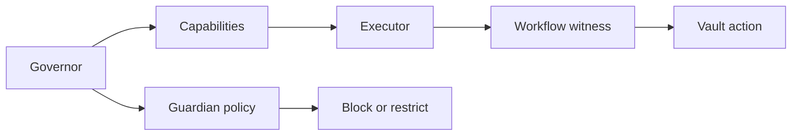

# Security

## Security

TITAN uses object ownership, capabilities, validation witnesses, and proof re-verification as its core control model.

### Security boundaries

* Governor-owned authority
* Scoped executor delegation
* Vault access through workflow witnesses
* Forecast freshness gates
* Guardian emergency actions
* Reserve and liquidity controls

### High-level model

### Source evidence

* [README](../../)
* [Mainnet Readiness Report](../deployment/mainnet_readiness_report.md)

### Related pages

* [Guardian System](guardian-system.md)
* [Forecast System](../programmable-money/forecast-system.md)
