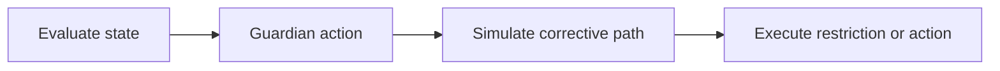

# Guardian System

## Guardian system

The guardian system is TITAN’s emergency control path.

It evaluates treasury state and can restrict or redirect behavior when policy conditions trip.

### What it covers

* emergency controls
* execution blocking
* risk enforcement
* governance protection hooks

### Flow

### Current status

Guardian flows are documented as chain verified on testnet at the workflow level.

Future guardian workflows can expand into broader autonomous treasury controls, but they should remain clearly separated from verified runtime behavior.

### References

* [guardian.move](../move-contracts/guardian.move.md)
* [Judge Readiness Report](../audit-and-proof-system/judge_readiness_report.md)
