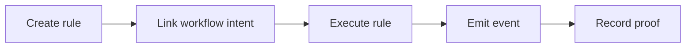

# Smart Wallet Rules

## Smart wallet rules

Smart wallet rules let TITAN bind repeatable actions to explicit rule objects.

The current satellite package focuses on three rule classes: balance invest, payroll date, and risk withdraw.

### Rule lifecycle

### What rules cover today

* Automated allocations
* Payroll triggers
* Risk-triggered withdrawals
* Workflow-linked execution proofs

### What rules do not cover yet

Autonomous keeper-style execution is not verified.

Conditional auto-investment logic beyond the published rule model is not verified.

### Current status

* Satellite rules package is deployed on testnet.
* Rule creation and rule execution are chain verified.
* Full monolithic integration into the core package is not verified.

### Source evidence

* [Smart Wallet Rules Verification](smart_wallet_rules_verification.md)
* [DeFi Final Verification](../references/reports/defi_final_verification.md)
