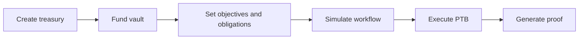

# Treasury System

## Treasury system

The treasury system turns a wallet balance into a governed mandate graph.

A treasury creates the base objects that later workflows depend on.

### What it creates

A treasury flow creates or links these core objects:

* `FinancialMandate`
* `MandateVault`
* `FinancialConstitution`
* `ObligationRegistry`
* delegation and forecast capabilities

### Primary workflow

### Template model

TITAN supports treasury templates for operational patterns such as startup, DAO, payroll, investment, creator, and protocol treasuries.

Templates are a product entrypoint. They still resolve to the same mandate and vault primitives on-chain.

### Section pages

* [Treasury Account](treasury-account.md)
* [Treasury Templates](treasury-templates.md)
* [Fund Treasury Audit — Slush signing gate](fund_treasury_audit.md)
* [Template Deployment Audit](template_deployment_audit.md)

### Current status

* Core treasury create and fund flows are chain verified on testnet.
* Treasury execution is proof-linked.
* Mainnet treasury deployment is not verified yet.

### Read next

* [Programmable Money](../programmable-money/)
* [Workflows](../workflows/)
* [Security](../security/)
* [Programmable Money Audit](../programmable-money/programmable_money_audit.md)
