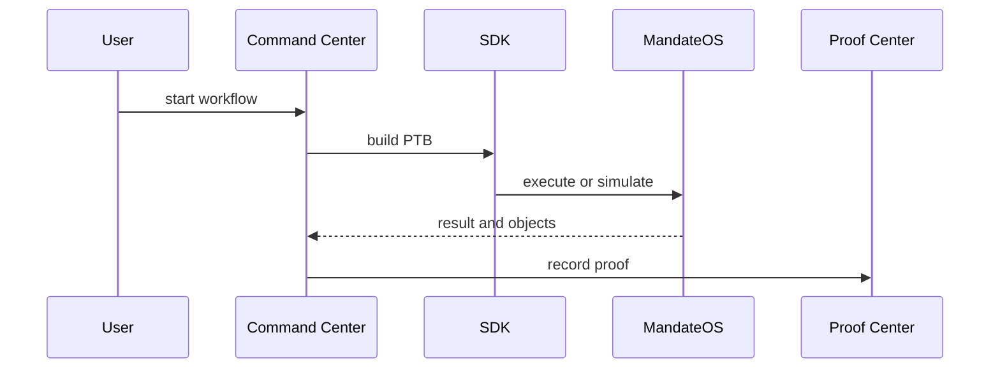

# Workflows

## Workflows

TITAN is organized around workflows, not standalone pages.

Each user path starts from a treasury context, moves through simulation or direct execution, and ends in proof and monitoring.

### Workflow pattern

### Covered flows

* Treasury creation
* Funding
* Obligation registration
* Delegation
* Simulation
* Execution
* Allocation
* Bridge routing
* Audit verification
* Portfolio monitoring

### Workflow pages

* [Treasury Creation](treasury-creation.md)
* [Funding](funding.md)
* [Obligation Registration](obligation-registration.md)
* [Delegation](delegation.md)
* [Simulation](simulation.md)
* [Execution](execution.md)
* [Allocation](allocation.md)
* [Bridge Routing Workflow](bridge-routing-workflow.md)
* [Audit Verification](audit-verification.md)
* [Portfolio Monitoring](portfolio-monitoring.md)
