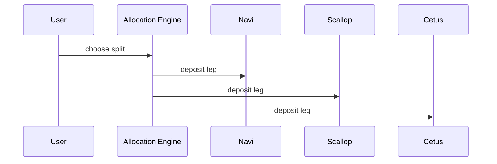

# Allocation

## Allocation

Allocation distributes capital across deployment targets.

In the current product, that routing is sequential and wallet-signed.

### Current status

Implemented in the product.

Full chain-verified reference evidence for the whole allocation path is still pending.

### References

* [Capital Deployment](../capital-deployment/)
* [Judge Readiness Report](../audit-and-proof-system/judge_readiness_report.md)
