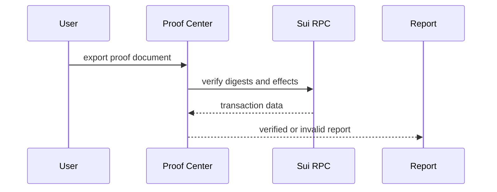

# Audit Verification

## Audit verification

Audit verification turns product activity into third-party evidence.

It is the final step for judges, auditors, and operators who need independent confirmation.

### References

* [Audit & Proof System](../audit-and-proof-system/)
* [Judge Verification Pack](../audit-and-proof-system/proof/)
