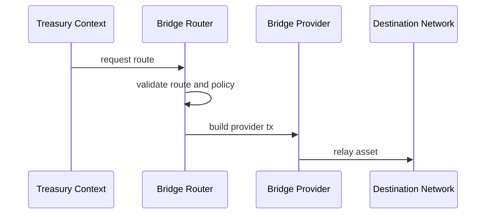

# Bridge Routing Workflow

## Bridge routing workflow

Bridge routing sits between allocation and destination deployment.

It is designed into the stack, but it is not yet a verified runtime path.

### Current status

Architecture exists.

Provider execution remains blocked pending dependency verification.

### References

* [Bridge Routing](../bridge-routing/)
* [Bridge Architecture — TITAN Programmable Money](../bridge-routing/bridge_architecture.md)
