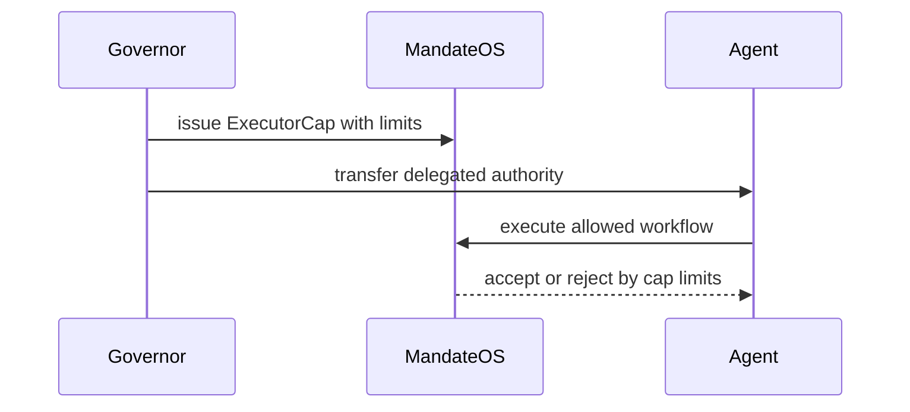

# Delegation

## Delegation

Delegation lets a governor authorize another actor to execute within defined limits.

The delegated actor does not inherit full treasury authority.

### Control surface

* per-transaction limits
* daily limits
* expiry
* permission mask

### References

* [Security](../security/)
* [Deployed System Diagrams](../audit-and-proof-system/proof/diagrams.md)
