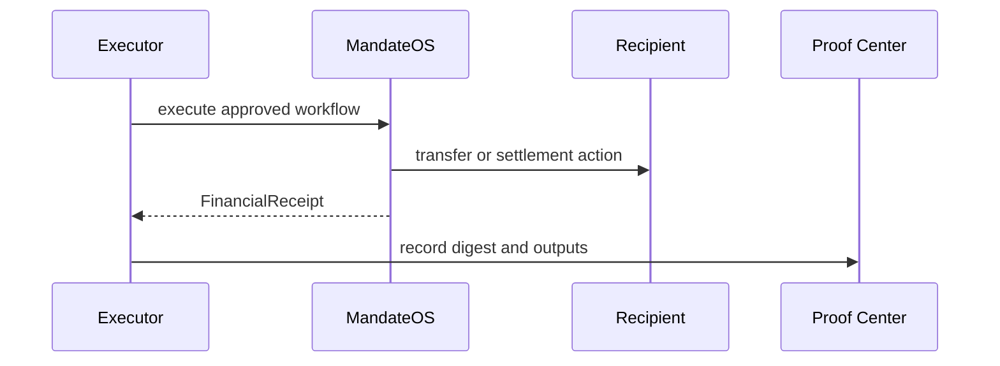

# Execution

## Execution

Execution consumes approved state and performs the treasury action.

This is where value moves and proof is created.

### Outputs

* treasury state changes
* receipt objects
* events
* proof records

### References

* [Audit & Proof System](../audit-and-proof-system/)
* [Programmable Money Audit](../programmable-money/programmable_money_audit.md)
