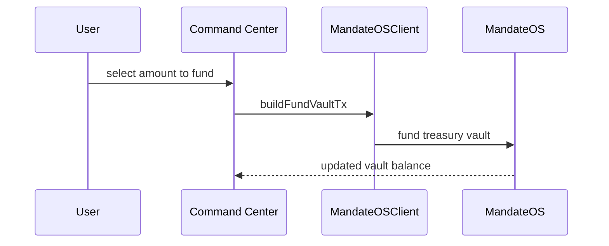

# Funding

## Funding

Funding turns an empty treasury graph into an executable treasury.

The vault must hold usable balance before obligations and workflow execution matter.

### Current status

Chain verified on testnet.

### References

* [Treasury Creation](treasury-creation.md)
* [Programmable Money Audit](../programmable-money/programmable_money_audit.md)
