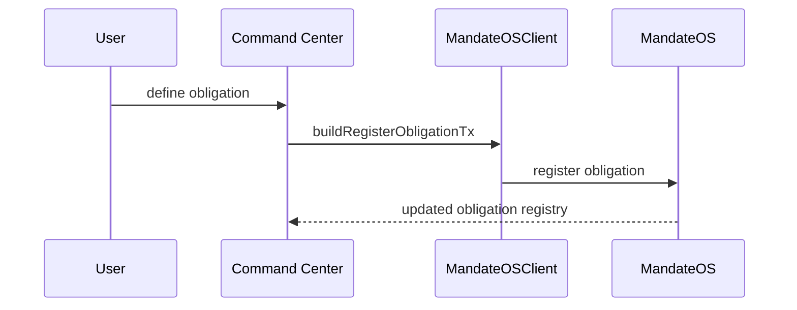

# Obligation Registration

## Obligation registration

Obligations express what the treasury owes.

They are the input for simulations, workflows, and downstream receipts.

### Current status

Chain verified on testnet.

### References

* [Treasury System](../treasury-system/)
* [Judge Flow](judge_flow.md)
