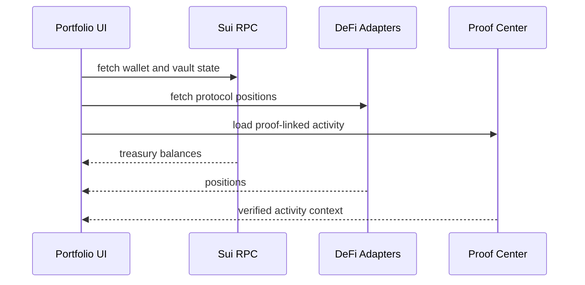

# Portfolio Monitoring

## Portfolio monitoring

Portfolio monitoring closes the workflow loop.

It shows whether treasury actions changed balances, positions, and exposure the way the workflow intended.

### References

* [Portfolio](../portfolio/)
* [Production Reality Audit](../references/reports/production_reality_audit.md)
