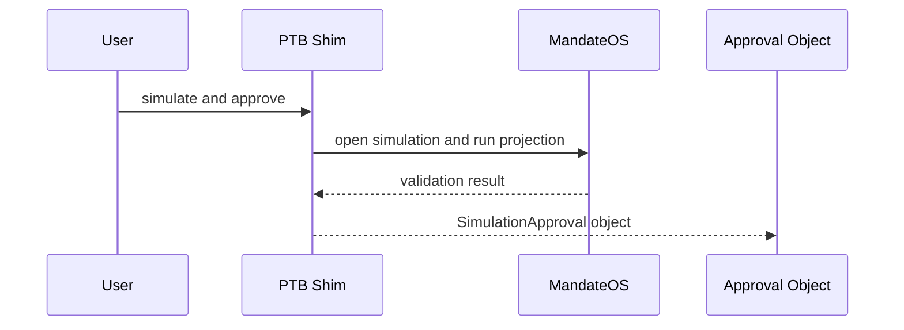

# Simulation

## Simulation

Simulation is the policy checkpoint before execution.

It evaluates whether a workflow should be approved under the current treasury state.

### Output

Simulation produces an approval witness that later execution consumes.

### References

* [Move Contracts](../move-contracts/)
* [Deployed System Diagrams](../audit-and-proof-system/proof/diagrams.md)
