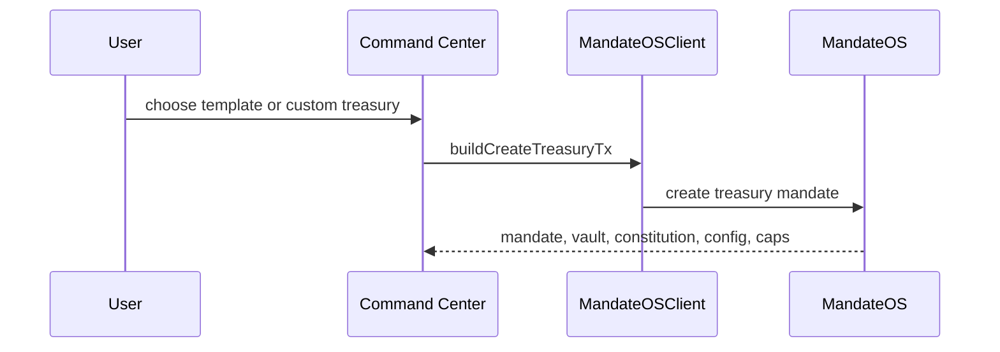

# Treasury Creation

## Treasury creation

Treasury creation is the root workflow.

It establishes the on-chain object graph that every later workflow uses.

### Objects created

* `FinancialMandate`
* `MandateVault`
* `FinancialConstitution`
* treasury config and delegation objects
* forecast and governance-linked capabilities

### Current status

Chain verified on testnet.

### References

* [Treasury System](../treasury-system/)
* [MandateOS — Treasury Flow (Testnet)](treasury_demo.md)
